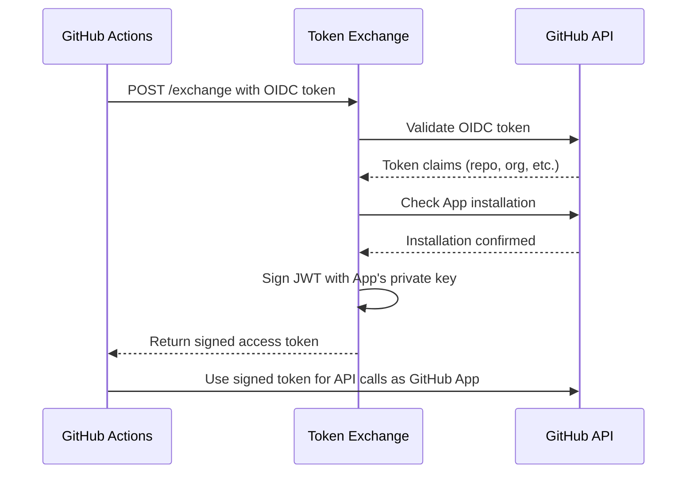

# GitHub Token Exchange

A secure token exchange service that converts GitHub Actions OIDC tokens into [GitHub App installation access tokens](https://docs.github.com/en/apps/creating-github-apps/authenticating-with-a-github-app/generating-an-installation-access-token-for-a-github-app). This enables GitHub Actions workflows to authenticate as a GitHub App for repository operations like creating PRs, issues, and comments.

## Overview

GitHub Actions workflows [can use OIDC tokens to authenticate with external services](https://docs.github.com/en/actions/security-for-github-actions/security-hardening-your-deployments/about-security-hardening-with-openid-connect?utm_source=chatgpt.com#updating-your-workflows-for-oidc), but sometimes you need the workflow to act as a GitHub App rather than using the default GITHUB_TOKEN. This service bridges that gap by:

1. Receiving an OIDC token from a GitHub Actions workflow
2. Validating the token with GitHub's OIDC provider
3. Checking that your GitHub App is installed on the target repository
4. Returning a short-lived access token signed with your App's private key

The workflow can then use this access token to perform operations as the GitHub App, with all the benefits of App-based authentication (better rate limits, clearer audit trails, granular permissions).

## How It Works

