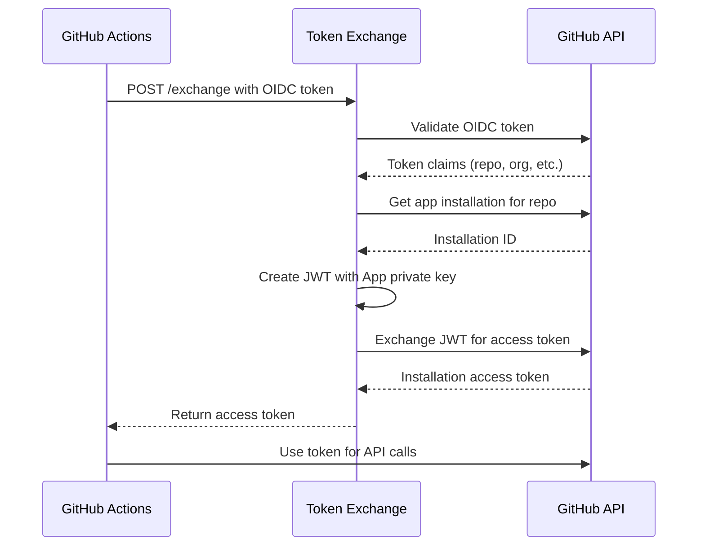

# GitHub Token Exchange

A secure token exchange service that converts GitHub Actions OIDC tokens into [GitHub App installation access tokens](https://docs.github.com/en/apps/creating-github-apps/authenticating-with-a-github-app/generating-an-installation-access-token-for-a-github-app). This enables GitHub Actions workflows to authenticate as a GitHub App for repository operations like creating PRs, issues, and comments.

## Overview

GitHub Actions workflows [can use OIDC tokens to authenticate with external services](https://docs.github.com/en/actions/security-for-github-actions/security-hardening-your-deployments/about-security-hardening-with-openid-connect?utm_source=chatgpt.com#updating-your-workflows-for-oidc). This service converts those OIDC tokens into GitHub App access tokens, allowing workflows to act as a GitHub App without requiring the App's private key to be stored in the repository(s).

## How It Works

1. Receives an OIDC token from a GitHub Actions workflow
2. Validates the token with GitHub's public keys and an `aud` check
3. Creates a JWT signed with your app's private key and exchanges for an installation access token
4. Returns a short-lived access token to perform operations as the GitHub App

